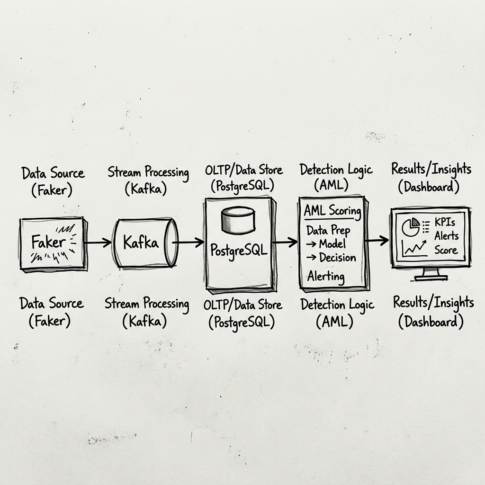
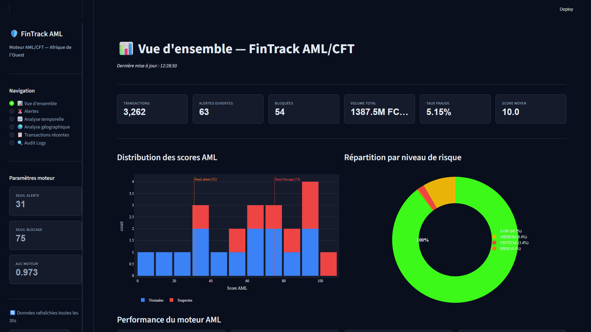
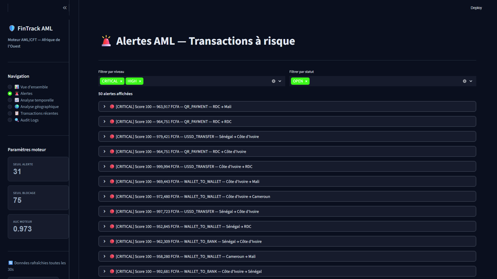
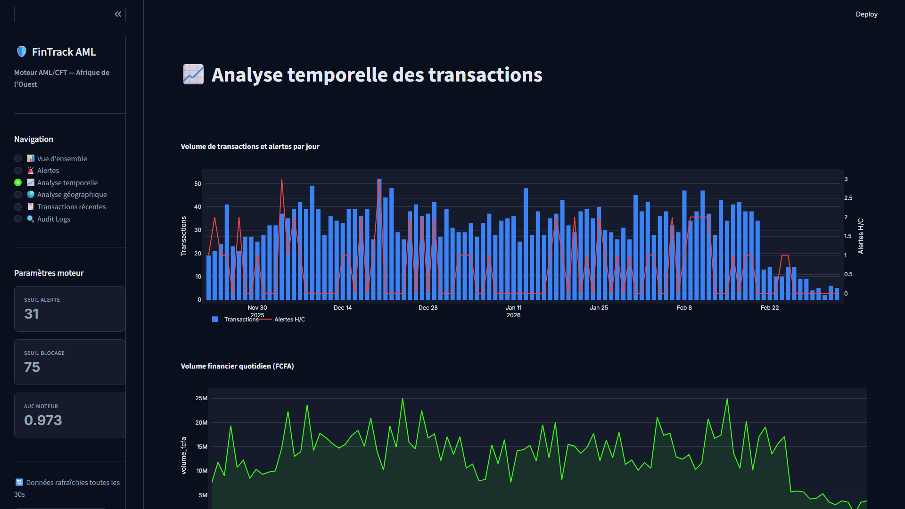

# FinTrack — Moteur AML/CFT pour l'Afrique de l'Ouest

FinTrack est une plateforme de bout en bout de lutte contre le blanchiment de capitaux et le financement du terrorisme (AML/CFT), spécialement conçue pour les flux financiers Mobile Money (ex: Wave, Orange Money) dans l'espace UEMOA. 

Le système propose une architecture hybride capable d'analyser des transactions en temps réel via Kafka et d'enrichir des historiques en batch, le tout piloté par un moteur de scoring métier et supervisé depuis un tableau de bord interactif.

---

## 🏛️ Architecture du Pipeline



L'architecture s'articule autour de quatre piliers principaux :

1. **Ingestion Temps Réel (Streaming)** : 
   - Un **Producer** Kafka simule le flux de transactions issues d'applications mobiles.
   - Un **Consumer** Kafka lit ce flux, insère la donnée en base, et interroge instantanément le moteur de scoring pour décider du statut de la transaction (Approuvée, En attente, Bloquée).
2. **Traitement Batch (Processing)** : 
   - Scripts d'extraction et de transformation (ETL) calculant des statistiques asynchrones sur le comportement des utilisateurs (moyennes, écart-types, z-scores) afin d'améliorer la détection des anomalies sans impacter la latence du flux temps réel.
3. **Moteur de Scoring (AML Engine)** : 
   - Moteur de règles pondérées basé sur la réglementation UEMOA et les typologies de fraudes locales. Il combine de multiples signaux pour émettre un score de risque (0-100) et lever des alertes.
4. **Supervision & Conformité (Dashboard & Audit)** : 
   - Une application **Streamlit** offre une vue d'ensemble sur les flux financiers, les alertes et les KPIs du système.
   - Un système de **Logs d'Audit** trace de manière immuable les décisions prises, garantissant la conformité réglementaire.

---

## 📸 Aperçu du Dashboard

### Vue d'ensemble


### Gestion des Alertes


### Analyse Temporelle


---

## 📂 Rôle de chaque fichier

### 1. Ingestion (`/ingestion`)
* **`producer.py`** : Simule un flux temps réel de transactions financières et les publie dans le topic Kafka `transactions`.
* **`consumer.py`** : Lit les messages Kafka en temps réel, enrichit les données, invoque le moteur AML pour la prise de décision (bloquer/accepter), enregistre les logs d'audit et persiste le résultat dans PostgreSQL.

### 2. Moteur AML (`/aml`)
* **`scoring.py`** : Le cœur de l'application. Contient les règles métiers, les pondérations et les seuils d'alerte pour calculer le score de risque d'une transaction.
* **`backtesting.py`** : Outil d'évaluation du moteur de règles permettant d'ajuster les poids des signaux sur un historique de données (optimisation des faux positifs).

### 3. Traitement Batch (`/processing`)
* **`transform.py`** : Pipeline ETL calculant le profil statistique "propre" de chaque utilisateur (z-scores, historique de smurfing, vélocité) utilisé par le consumer temps réel.
* **`load.py` & `schema.sql`** : Scripts responsables de l'initialisation de la base de données PostgreSQL (création des tables `users`, `transactions`, `alerts`, `audit_logs`).

### 4. Supervision & Conformité (`/dashboard` & `/audit`)
* **`dashboard/app.py`** : Interface Streamlit de suivi temps réel (KPIs globaux, analyse temporelle et géographique, traitement des alertes).
* **`audit/logger.py`** : Module de traçabilité générant des logs conformes aux exigences réglementaires, notamment lors des blocages ou dépassements de seuils.

### 5. Infrastructure et Données
* **`data/generator.py`** (présumé) : Générateur de données synthétiques (utilisateurs, transactions suspectes et normales).
* **`docker-compose.yml`** : Configuration pour lancer facilement l'infrastructure Kafka et Zookeeper en local.
* **`requirements.txt`** : Liste des dépendances Python du projet.

---

## ⚙️ Installation et Utilisation

### Prérequis
- Python 3.9+
- Docker & Docker Compose
- PostgreSQL (serveur local ou distant)

### 1. Initialisation de l'environnement
Cloner le projet et installer les dépendances :
```bash
python -m venv venv
source venv/bin/activate  # Sur Windows : venv\Scripts\activate
pip install -r requirements.txt
```

### 2. Configuration
Créer un fichier `.env` à la racine en s'inspirant des variables nécessaires :
```env
DB_HOST=localhost
DB_PORT=5432
DB_USER=postgres
DB_PASSWORD=secret
DB_NAME=fintrack
KAFKA_BROKER=localhost:9092
```

### 3. Démarrage de l'infrastructure (Kafka & BDD)
Lancer Zookeeper et Kafka via Docker :
```bash
docker-compose up -d
```
Initialiser la base de données PostgreSQL (assurez-vous que la DB existe) :
```bash
# Selon votre configuration, exécuter le script SQL ou Python
python processing/load.py
```

### 4. Lancement du Pipeline
Pour tester le système complet, ouvrez plusieurs terminaux :

**Terminal 1 : Lancer le Consumer (Écoute et Scoring temps réel)**
```bash
python ingestion/consumer.py
```

**Terminal 2 : Lancer le Producer (Simulation du flux)**
```bash
python ingestion/producer.py --continu
```

**Terminal 3 : Lancer le Dashboard**
```bash
streamlit run dashboard/app.py
```

Pour mettre à jour les statistiques utilisateurs historiques, lancez périodiquement :
```bash
python processing/transform.py
```

---

## 🌍 Contexte Métier : AML/CFT & Espace UEMOA

Ce système a été pensé pour répondre aux contraintes spécifiques de la lutte contre la criminalité financière dans la zone UEMOA (Union Économique et Monétaire Ouest-Africaine) :

- **Réglementation CENTIF** : Le système génère un signal d'alerte critique automatique et un log d'audit spécifique pour toute transaction dépassant le seuil réglementaire de **1 000 000 FCFA**, facilitant les déclarations de soupçon (DS) à la Cellule Nationale de Traitement des Informations Financières.
- **Détection du Smurfing (Structuring)** : Surveillance algorithmique des transactions se situant juste sous le seuil déclaratif (ex: transactions répétées entre 900 000 et 999 999 FCFA) pour contourner la surveillance réglementaire.
- **Typologies Mobile Money** : Les règles intègrent des cas d'usage caractéristiques des portefeuilles électroniques ouest-africains :
  - *SIM Swap* : Alerte sur les transactions à haut risque survenant juste après un changement de carte SIM.
  - *Vélocité anormale* : Détection d'activités compulsives (ex: >10 transactions par heure) caractéristiques de vidages de comptes volés.
  - *Activité Nocturne* : Pondération accrue pour les transferts réalisés sur des plages horaires atypiques (1h - 4h du matin).
- **Approche par les Risques** : Le système ne bloque pas aveuglément mais adopte une "Risk-Based Approach". La combinaison intelligente de signaux faibles (Z-score élevé + SIM Swap récent + Activité nocturne) permet de justifier la suspension d'une transaction (Statut `PENDING` ou `BLOCKED`) pour examen manuel par un compliance officer.
